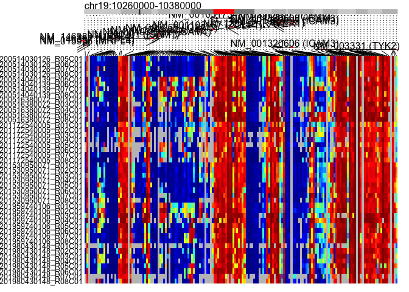
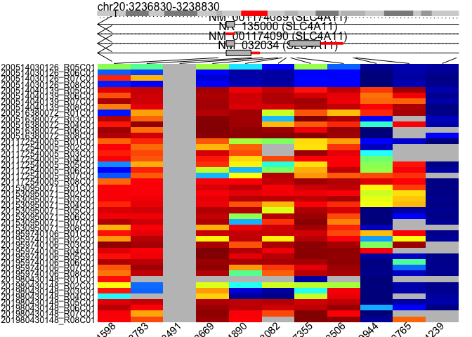
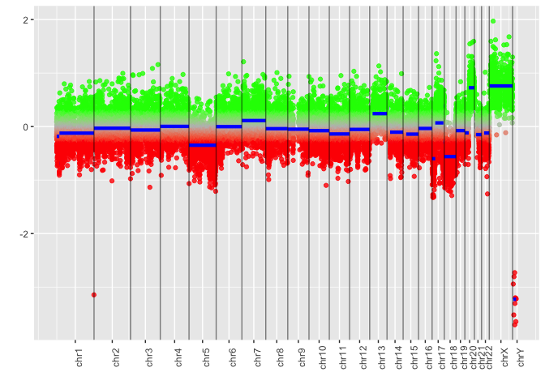
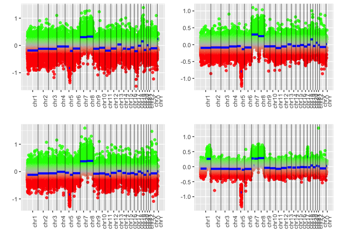

DMA with Sesame
================
Xiaoyu Yan
2/3/2020

# Tumor gland

## Create sample directory file

``` r
directory <- read_csv(paste0(data_dir,"directory.csv"))
```

    ## Parsed with column specification:
    ## cols(
    ##   plate = col_double(),
    ##   well_position = col_character(),
    ##   sentrix_id = col_double(),
    ##   sentrix_position = col_character(),
    ##   sample_id = col_character(),
    ##   description = col_character(),
    ##   tissue = col_character(),
    ##   type = col_character(),
    ##   age = col_double(),
    ##   sex = col_character(),
    ##   normal_7_19 = col_logical(),
    ##   jh_11_19 = col_logical()
    ## )

``` r
directory <- directory %>% select(-type)

tumor_gland <- directory %>% filter(description == "tumor gland")
write.table(tumor_gland, file = "tumor_gland_dir.csv", quote = F, sep = ",", row.names = F)

# make tumor gland idat dir
tumor_gland_dir <- data.frame(union(paste("mkdir", paste0(data_dir, "tumor_gland")), 
                                    paste("cp", paste0(tumor_gland$sentrix_id, "_",
                                                       tumor_gland$sentrix_position, "*.*"), 
                                          paste0(data_dir, "tumor_gland"))
                                    )
                              )
write.table(tumor_gland_dir,file = "tumor_gland_dir.sh", quote = F, row.names = F, col.names = F)
```

## Idat file classification

``` bash
cd ~/Downloads/MethData
sh ~/Desktop/Graduate/DifferentialMethylationAnalysis/tumor_gland_dir.sh
```

    ## mkdir: /Users/yanxiaoyu/Desktop/Graduate/MethData/tumor_gland: File exists

## Read data & Get betas

``` r
# Read IDATs into SigSet list
ssets_tumor_gland <- lapply(
  searchIDATprefixes(paste0(data_dir, "tumor_gland")), readIDATpair)
  
ssets <- sapply(
  ssets_tumor_gland, function(pfx) {
    pfx %>%
    pOOBAH %>% # sets the p-value for each probe
    noob #%>% # background subtraction based on normal-exponential deconvolution 
    #dyeBiasCorrTypeINorm # correction nonlinear quantile interpolation with Type-I probes
    }
  )

betas <- sapply(ssets, getBetas)
```

## Sample infer & QC

``` r
# Sex infer
Sex <- vapply(ssets, inferSex, character(1))
SexKaryotypes <- vapply(ssets, inferSexKaryotypes, character(1))
# Ethnicity infer
Ethnicity <- vapply(ssets, inferEthnicity, character(1))
# Age infer
Age <- apply(betas, 2, predictAgeHorvath353)

# Mean intensity
meanIntensity <- vapply(ssets, meanIntensity, numeric(1))
# Bisulfite conversion control using GCT scores
# The closer the score to 1.0, the more complete the bisulfite conversion.
bcc <- vapply(ssets, bisConversionControl, numeric(1))
```

## Visualization

``` r
# Visualize all probes from a gene
visualizeGene('DNMT1', betas, platform='EPIC')
```

<!-- -->

``` r
# Visualize probes from arbitrary region
visualizeRegion(
  'chr19',10260000,10380000, betas, platform='EPIC',
  show.probeNames = FALSE)
```

<!-- -->

``` r
# Visualize by probe names
visualizeProbes(c("cg02382400", "cg03738669"), betas, platform='EPIC')
```

<!-- -->

``` r
# Copy number variation
# >50bp
# red -- del blu -- dup grn -- ins
ssets.normal <- sesameDataGet('EPIC.5.normal')
segs <- cnSegmentation(ssets[[1]], ssets.normal)
visualizeSegments(segs)
```

<!-- -->

``` r
tumor_gland_ssets <- ssets
tumor_gland_betas <- betas
tumor_gland_segs <- segs
```

## Comparision

### A side & B side

``` r
# copy number variation plot function
CNV <- function(x) {cnSegmentation(ssets[[x]], ssets.normal) %>%
  visualizeSegments()
}
```

``` r
# look up sample ID
A <- tumor_gland %>% filter(grepl("A", sample_id)) %>% select(plate, sentrix_id, sentrix_position)

which(grepl("A", tumor_gland$sample_id))
```

    ##  [1]  1  2  5  6  9 10 13 14 18 19 21 22 25 26 29 30 33 34 37 38 41 42 45 46

``` r
tumor_gland$sample_id[which(grepl("A", tumor_gland$sample_id))]
```

    ##  [1] "PA LL 1" "PA LL 2" "SA LL 5" "SA LL 6" "DA LL 1" "DA LL 2" "SA LL 1"
    ##  [8] "SA LL 2" "UA L -2" "UA L -3" "XA L -5" "XA L -6" "EA LL 1" "EA LL2" 
    ## [15] "JA LL 1" "JALL 2"  "HALL-1"  "HALL-2"  "CA LL"   "CA LL"   "FA LL"  
    ## [22] "FA LL"   "KA LL"   "KA LL"

``` r
library(gbm)
```

    ## Loaded gbm 2.1.5

``` r
# individual 
grid.arrange(CNV(1), CNV(2), CNV(3), CNV(4), CNV(5), CNV(6), CNV(7), CNV(8), CNV(9), CNV(10), CNV(11), CNV(12), CNV(13), CNV(14), CNV(15), CNV(16), CNV(17), CNV(18), CNV(19), CNV(20), nrow = 6, ncol = 4)
```

<!-- -->

``` r
# individual S
grid.arrange(CNV(5), CNV(6), CNV(7), CNV(8), nrow = 2, ncol = 2)
```

<!-- -->

``` r
# individual P
grid.arrange(CNV(1), CNV(2), CNV(3), CNV(4), nrow = 2, ncol = 2)
```

<!-- -->

# Colon crypt

``` r
colon_crypt <- directory %>%
  filter((grepl("colon", tissue)&grepl("crypt", description)))
write.table(colon_crypt, file = "colon_crypt_dir.csv", quote = F, sep = ",", row.names = F)

# make colon_crypt idat dir
colon_crypt_dir <- data.frame(union(paste("mkdir", paste0(data_dir, "colon_crypt")), 
                                    paste("cp", paste0(colon_crypt$sentrix_id, "_",
                                                       colon_crypt$sentrix_position, "*.*"), 
                                          paste0(data_dir, "colon_crypt"))
                                    )
                              )
write.table(colon_crypt_dir,file = "colon_crypt_dir.sh", quote = F, row.names = F, col.names = F)
```

## Idat file classification

## Read data & Get betas

``` r
# Read IDATs into SigSet list
ssets_colon_crypt <- lapply(
  searchIDATprefixes(paste0(data_dir, "colon_crypt")), readIDATpair)
  
ssets <- sapply(
  ssets_colon_crypt, function(pfx) {
    pfx %>%
    pOOBAH %>% # sets the p-value for each probe
    noob #%>% # background subtraction based on normal-exponential deconvolution 
    #dyeBiasCorrTypeINorm # correction nonlinear quantile interpolation with Type-I probes
    }
  )

betas <- sapply(ssets, getBetas)
```

## Sample infer & QC

``` r
# Sex infer
Sex <- vapply(ssets, inferSex, character(1))
SexKaryotypes <- vapply(ssets, inferSexKaryotypes, character(1))
# Ethnicity infer
Ethnicity <- vapply(ssets, inferEthnicity, character(1))
# Age infer
Age <- apply(betas, 2, predictAgeHorvath353)

# Mean intensity
meanIntensity <- vapply(ssets, meanIntensity, numeric(1))
# Bisulfite conversion control using GCT scores
# The closer the score to 1.0, the more complete the bisulfite conversion.
bcc <- vapply(ssets, bisConversionControl, numeric(1))
```

## Visualization

``` r
# Visualize all probes from a gene
visualizeGene('DNMT1', betas, platform='EPIC')
```

<!-- -->

``` r
# Visualize probes from arbitrary region
visualizeRegion(
  'chr19',10260000,10380000, betas, platform='EPIC',
  show.probeNames = FALSE)
```

<!-- -->

``` r
# Visualize by probe names
visualizeProbes(c("cg02382400", "cg03738669"), betas, platform='EPIC')
```

<!-- -->

``` r
# Copy number variation
# >50bp
# red -- del blu -- dup grn -- ins
ssets.normal <- sesameDataGet('EPIC.5.normal')
segs <- cnSegmentation(ssets[[1]], ssets.normal)
visualizeSegments(segs)
```

<!-- -->

``` r
colon_crypt_ssets <- ssets
colon_crypt_betas <- betas
colon_crypt_segs <- segs
```

# SI crypt

``` r
small_crypt <- directory %>% 
  filter(grepl("(SI crypt|crypt SI)", description))
write.table(small_crypt, file = "small_crypt_dir.csv", quote = F, sep = ",", row.names = F)

# make small_crypt idat dir
small_crypt_dir <- data.frame(union(paste("mkdir", paste0(data_dir, "small_crypt")), 
                                    paste("cp", paste0(small_crypt$sentrix_id, "_",
                                                       small_crypt$sentrix_position, "*.*"), 
                                          paste0(data_dir, "small_crypt"))
                                    )
                              )
write.table(small_crypt_dir,file = "small_crypt_dir.sh", quote = F, row.names = F, col.names = F)
```

## Idat file classification

## Read data & Get betas

``` r
# Read IDATs into SigSet list
ssets_small_crypt <- lapply(
  searchIDATprefixes(paste0(data_dir, "small_crypt")), readIDATpair)
  
ssets <- sapply(
  ssets_small_crypt, function(pfx) {
    pfx %>%
    pOOBAH %>% # sets the p-value for each probe
    noob #%>% # background subtraction based on normal-exponential deconvolution 
    #dyeBiasCorrTypeINorm # correction nonlinear quantile interpolation with Type-I probes
    }
  )

betas <- sapply(ssets, getBetas)
```

## Sample infer & QC

``` r
# Sex infer
Sex <- vapply(ssets, inferSex, character(1))
SexKaryotypes <- vapply(ssets, inferSexKaryotypes, character(1))
# Ethnicity infer
Ethnicity <- vapply(ssets, inferEthnicity, character(1))
# Age infer
Age <- apply(betas, 2, predictAgeHorvath353)

# Mean intensity
meanIntensity <- vapply(ssets, meanIntensity, numeric(1))
# Bisulfite conversion control using GCT scores
# The closer the score to 1.0, the more complete the bisulfite conversion.
bcc <- vapply(ssets, bisConversionControl, numeric(1))
```

## Visualization

``` r
# Visualize all probes from a gene
visualizeGene('DNMT1', betas, platform='EPIC')
```

<!-- -->

``` r
# Visualize probes from arbitrary region
visualizeRegion(
  'chr19',10260000,10380000, betas, platform='EPIC',
  show.probeNames = FALSE)
```

<!-- -->

``` r
# Visualize by probe names
visualizeProbes(c("cg02382400", "cg03738669"), betas, platform='EPIC')
```

<!-- -->

``` r
# Copy number variation
# >50bp
# red -- del blu -- dup grn -- ins
ssets.normal <- sesameDataGet('EPIC.5.normal')
segs <- cnSegmentation(ssets[[1]], ssets.normal)
visualizeSegments(segs)
```

<!-- -->

``` r
small_crypt_ssets <- ssets
small_crypt_betas <- betas
small_crypt_segs <- segs
```

# Endometrial Gland

``` r
endom_gland <- directory %>% 
  filter(grepl("(endo|endometrial)", description))
write.table(endom_gland, file = "endom_gland_dir.csv", quote = F, sep = ",", row.names = F)

# make endom_gland idat dir
endom_gland_dir <- data.frame(union(paste("mkdir", paste0(data_dir, "endom_gland")), 
                                    paste("cp", paste0(endom_gland$sentrix_id, "_",
                                                       endom_gland$sentrix_position, "*.*"), 
                                          paste0(data_dir, "endom_gland"))
                                    )
                              )
write.table(endom_gland_dir,file = "endom_gland_dir.sh", quote = F, row.names = F, col.names = F)
```

## Idat file classification

``` bash
cd ~/Downloads/MethData
sh ~/Desktop/Graduate/DMA/endom_gland_dir.sh
```

    ## mkdir: /Users/yanxiaoyu/Desktop/Graduate/MethData/endom_gland: File exists

## Read data & Get betas

``` r
# Read IDATs into SigSet list
ssets_endom_gland <- lapply(
  searchIDATprefixes(paste0(data_dir, "endom_gland")), readIDATpair)
  
ssets <- sapply(
  ssets_endom_gland, function(pfx) {
    pfx %>%
    pOOBAH %>% # sets the p-value for each probe
    noob #%>% # background subtraction based on normal-exponential deconvolution 
    #dyeBiasCorrTypeINorm # correction nonlinear quantile interpolation with Type-I probes
    }
  )

betas <- sapply(ssets, getBetas)
```

## Sample infer & QC

``` r
# Sex infer
Sex <- vapply(ssets, inferSex, character(1))
SexKaryotypes <- vapply(ssets, inferSexKaryotypes, character(1))
# Ethnicity infer
Ethnicity <- vapply(ssets, inferEthnicity, character(1))
# Age infer
Age <- apply(betas, 2, predictAgeHorvath353)

# Mean intensity
meanIntensity <- vapply(ssets, meanIntensity, numeric(1))
# Bisulfite conversion control using GCT scores
# The closer the score to 1.0, the more complete the bisulfite conversion.
bcc <- vapply(ssets, bisConversionControl, numeric(1))
```

## Visualization

``` r
# Visualize all probes from DNA methyltransferase 1
visualizeGene('DNMT1', betas, platform='EPIC')
```

<!-- -->

``` r
# Visualize probes from arbitrary region
visualizeRegion(
  'chr19',10260000,10380000, betas, platform='EPIC',
  show.probeNames = FALSE)
```

<!-- -->

``` r
# Visualize by probe names
visualizeProbes(c("cg02382400", "cg03738669"), betas, platform='EPIC')
```

<!-- -->

``` r
# Copy number variation
# >50bp
# red -- del blu -- dup grn -- ins
ssets.normal <- sesameDataGet('EPIC.5.normal')
segs <- cnSegmentation(ssets[[1]], ssets.normal)
visualizeSegments(segs)
```

<!-- -->

``` r
endom_gland_ssets <- ssets
endom_gland_betas <- betas
endom_gland_segs <- segs
```

# Bulk Sample

## Idat file classification

``` bash
cd ~/Downloads/MethData
sh ~/Desktop/Graduate/DMA/bulk_sample_dir.sh
```

    ## mkdir: /Users/yanxiaoyu/Desktop/Graduate/MethData/bulk_sample: File exists

## Read data & Get betas

``` r
# Read IDATs into SigSet list
ssets_bulk_sample <- lapply(
  searchIDATprefixes(paste0(data_dir, "bulk_sample")), readIDATpair)
  
ssets <- sapply(
  ssets_bulk_sample, function(pfx) {
    pfx %>%
    pOOBAH %>% # sets the p-value for each probe
    noob #%>% # background subtraction based on normal-exponential deconvolution 
    #dyeBiasCorrTypeINorm # correction nonlinear quantile interpolation with Type-I probes
    }
  )

betas <- sapply(ssets, getBetas)
```

## Sample infer & QC

``` r
# Sex infer
Sex <- vapply(ssets, inferSex, character(1))
SexKaryotypes <- vapply(ssets, inferSexKaryotypes, character(1))
# Ethnicity infer
Ethnicity <- vapply(ssets, inferEthnicity, character(1))
# Age infer
Age <- apply(betas, 2, predictAgeHorvath353)

# Mean intensity
meanIntensity <- vapply(ssets, meanIntensity, numeric(1))
# Bisulfite conversion control using GCT scores
# The closer the score to 1.0, the more complete the bisulfite conversion.
bcc <- vapply(ssets, bisConversionControl, numeric(1))
```

## Visualization

``` r
# Visualize all probes from DNA methyltransferase 1
visualizeGene('DNMT1', betas, platform='EPIC')
```

<!-- -->

``` r
# Visualize probes from arbitrary region
visualizeRegion(
  'chr19',10260000,10380000, betas, platform='EPIC',
  show.probeNames = FALSE)
```

<!-- -->

``` r
# Visualize by probe names
visualizeProbes(c("cg02382400", "cg03738669"), betas, platform='EPIC')
```

<!-- -->

``` r
# Copy number variation
# >50bp
# red -- del blu -- dup grn -- ins
ssets.normal <- sesameDataGet('EPIC.5.normal')
segs <- cnSegmentation(ssets[[1]], ssets.normal)
visualizeSegments(segs)
```

<!-- -->

``` r
bulk_sample_ssets <- ssets
bulk_sample_betas <- betas
bulk_sample_segs <- segs
```
