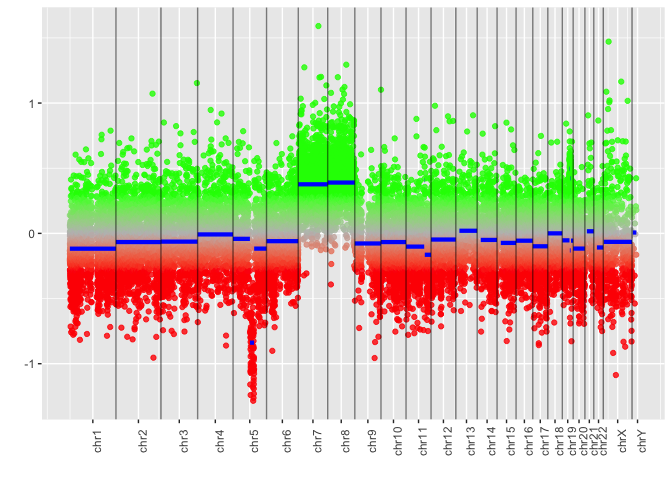

DMA with Sesame
================
Xiaoyu Yan
2/3/2020

``` r
library(sesame)
```

    ## Loading required package: sesameData

    ## Loading required package: ExperimentHub

    ## Loading required package: BiocGenerics

    ## Loading required package: parallel

    ## 
    ## Attaching package: 'BiocGenerics'

    ## The following objects are masked from 'package:parallel':
    ## 
    ##     clusterApply, clusterApplyLB, clusterCall, clusterEvalQ,
    ##     clusterExport, clusterMap, parApply, parCapply, parLapply,
    ##     parLapplyLB, parRapply, parSapply, parSapplyLB

    ## The following objects are masked from 'package:stats':
    ## 
    ##     IQR, mad, sd, var, xtabs

    ## The following objects are masked from 'package:base':
    ## 
    ##     anyDuplicated, append, as.data.frame, basename, cbind, colnames,
    ##     dirname, do.call, duplicated, eval, evalq, Filter, Find, get, grep,
    ##     grepl, intersect, is.unsorted, lapply, Map, mapply, match, mget,
    ##     order, paste, pmax, pmax.int, pmin, pmin.int, Position, rank,
    ##     rbind, Reduce, rownames, sapply, setdiff, sort, table, tapply,
    ##     union, unique, unsplit, which, which.max, which.min

    ## Loading required package: AnnotationHub

    ## Loading required package: BiocFileCache

    ## Loading required package: dbplyr

    ## Loading sesameData.

``` r
library(unpivotr)
library(tidyverse)
```

    ## ── Attaching packages ───────────────────────────────────────── tidyverse 1.3.0 ──

    ## ✓ ggplot2 3.2.1     ✓ purrr   0.3.3
    ## ✓ tibble  2.1.3     ✓ dplyr   0.8.4
    ## ✓ tidyr   1.0.2     ✓ stringr 1.4.0
    ## ✓ readr   1.3.1     ✓ forcats 0.4.0

    ## ── Conflicts ──────────────────────────────────────────── tidyverse_conflicts() ──
    ## x dplyr::combine()    masks BiocGenerics::combine()
    ## x dplyr::filter()     masks stats::filter()
    ## x dplyr::ident()      masks dbplyr::ident()
    ## x dplyr::lag()        masks stats::lag()
    ## x tidyr::pack()       masks unpivotr::pack()
    ## x ggplot2::Position() masks BiocGenerics::Position(), base::Position()
    ## x dplyr::sql()        masks dbplyr::sql()
    ## x tidyr::unpack()     masks unpivotr::unpack()

``` r
data_dir <- "~/Desktop/Graduate/MethData/"
```

# Tumor gland

## Create sample directory file

``` r
directory <- read_csv(paste0(data_dir,"directory.csv"))
```

    ## Parsed with column specification:
    ## cols(
    ##   plate = col_double(),
    ##   well_position = col_character(),
    ##   sentrix_id = col_double(),
    ##   sentrix_position = col_character(),
    ##   sample_id = col_character(),
    ##   description = col_character(),
    ##   tissue = col_character(),
    ##   type = col_character(),
    ##   age = col_double(),
    ##   sex = col_character(),
    ##   normal_7_19 = col_logical(),
    ##   jh_11_19 = col_logical()
    ## )

``` r
directory <- directory %>% select(-type)

tumor_gland <- directory %>% filter(description == "tumor gland")
write.table(tumor_gland, file = "tumor_gland_dir.csv", quote = F, sep = ",", row.names = F)

# make tumor gland idat dir
tumor_gland_dir <- data.frame(union(paste("mkdir", paste0(data_dir, "tumor_gland")), 
                                    paste("cp", paste0(tumor_gland$sentrix_id, "_",
                                                       tumor_gland$sentrix_position, "*.*"), 
                                          paste0(data_dir, "tumor_gland"))
                                    )
                              )
write.table(tumor_gland_dir,file = "tumor_gland_dir.sh", quote = F, row.names = F, col.names = F)
```

## Idat file classification

## Read data & Get betas

``` r
# Read IDATs into SigSet list
ssets_tumor_gland <- lapply(
  searchIDATprefixes(paste0(data_dir, "tumor_gland")), readIDATpair)
  
ssets <- sapply(
  ssets_tumor_gland, function(pfx) {
    pfx %>%
    pOOBAH %>% # sets the p-value for each probe
    noob #%>% # background subtraction based on normal-exponential deconvolution 
    #dyeBiasCorrTypeINorm # correction nonlinear quantile interpolation with Type-I probes
    }
  )

betas <- sapply(ssets, getBetas)
```

## Sample infer & QC

``` r
# Sex infer
Sex <- vapply(ssets, inferSex, character(1))
SexKaryotypes <- vapply(ssets, inferSexKaryotypes, character(1))
# Ethnicity infer
Ethnicity <- vapply(ssets, inferEthnicity, character(1))
# Age infer
Age <- apply(betas, 2, predictAgeHorvath353)

# Mean intensity
meanIntensity <- vapply(ssets, meanIntensity, numeric(1))
# Bisulfite conversion control using GCT scores
# The closer the score to 1.0, the more complete the bisulfite conversion.
bcc <- vapply(ssets, bisConversionControl, numeric(1))
```

## Visualization

``` r
# Visualize all probes from a gene
visualizeGene('DNMT1', betas, platform='EPIC')
```

    ## Loading required package: GenomicRanges

    ## Loading required package: stats4

    ## Loading required package: S4Vectors

    ## 
    ## Attaching package: 'S4Vectors'

    ## The following objects are masked from 'package:dplyr':
    ## 
    ##     first, rename

    ## The following object is masked from 'package:tidyr':
    ## 
    ##     expand

    ## The following object is masked from 'package:base':
    ## 
    ##     expand.grid

    ## Loading required package: IRanges

    ## 
    ## Attaching package: 'IRanges'

    ## The following objects are masked from 'package:dplyr':
    ## 
    ##     collapse, desc, slice

    ## The following object is masked from 'package:purrr':
    ## 
    ##     reduce

    ## Loading required package: GenomeInfoDb

    ## Loading required package: wheatmap

<!-- -->

``` r
# Visualize probes from arbitrary region
visualizeRegion(
  'chr19',10260000,10380000, betas, platform='EPIC',
  show.probeNames = FALSE)
```

<!-- -->

``` r
# Visualize by probe names
visualizeProbes(c("cg02382400", "cg03738669"), betas, platform='EPIC')
```

<!-- -->

``` r
# Copy number variation
# >50bp
# red -- del blu -- dup grn -- ins
ssets.normal <- sesameDataGet('EPIC.5.normal')
segs <- cnSegmentation(ssets[[1]], ssets.normal)
```

    ## Loading required package: DNAcopy

``` r
visualizeSegments(segs)
```

    ## Loading required package: scales

    ## 
    ## Attaching package: 'scales'

    ## The following object is masked from 'package:purrr':
    ## 
    ##     discard

    ## The following object is masked from 'package:readr':
    ## 
    ##     col_factor

<!-- -->

``` r
tumor_gland_ssets <- ssets
tumor_gland_betas <- betas
tumor_gland_segs <- segs
```

## Comparision

``` r
A <- tumor_gland %>% filter(grepl("A", sample_id)) %>% select(plate, sentrix_id, sentrix_position)
B <- tumor_gland %>% filter(grepl("B", sample_id)) %>% select(plate, sentrix_id, sentrix_position) 
A
```

    ## # A tibble: 24 x 3
    ##    plate   sentrix_id sentrix_position
    ##    <dbl>        <dbl> <chr>           
    ##  1  1483 201980430148 R01C01          
    ##  2  1483 201980430148 R02C01          
    ##  3  1483 201980430148 R05C01          
    ##  4  1483 201980430148 R06C01          
    ##  5  1464 201959740106 R01C01          
    ##  6  1464 201959740106 R02C01          
    ##  7  1464 201959740106 R05C01          
    ##  8  1464 201959740106 R06C01          
    ##  9  1451 201530950071 R02C01          
    ## 10  1451 201530950071 R03C01          
    ## # … with 14 more rows

``` r
CNV <- function(x) {cnSegmentation(ssets[[x]], ssets.normal) %>%
  visualizeSegments()
}
```

``` r
CNV(1)
```

<!-- -->

``` r
CNV(2)
```

<!-- -->

``` r
CNV(3)
```

<!-- -->

``` r
CNV(4)
```

<!-- -->

# Colon crypt

``` r
colon_crypt <- directory %>%
  filter((grepl("colon", tissue)&grepl("crypt", description)))
write.table(colon_crypt, file = "colon_crypt_dir.csv", quote = F, sep = ",", row.names = F)

# make colon_crypt idat dir
colon_crypt_dir <- data.frame(union(paste("mkdir", paste0(data_dir, "colon_crypt")), 
                                    paste("cp", paste0(colon_crypt$sentrix_id, "_",
                                                       colon_crypt$sentrix_position, "*.*"), 
                                          paste0(data_dir, "colon_crypt"))
                                    )
                              )
write.table(colon_crypt_dir,file = "colon_crypt_dir.sh", quote = F, row.names = F, col.names = F)
```

## Idat file classification

## Read data & Get betas

``` r
# Read IDATs into SigSet list
ssets_colon_crypt <- lapply(
  searchIDATprefixes(paste0(data_dir, "colon_crypt")), readIDATpair)
  
ssets <- sapply(
  ssets_colon_crypt, function(pfx) {
    pfx %>%
    pOOBAH %>% # sets the p-value for each probe
    noob #%>% # background subtraction based on normal-exponential deconvolution 
    #dyeBiasCorrTypeINorm # correction nonlinear quantile interpolation with Type-I probes
    }
  )

betas <- sapply(ssets, getBetas)
```

## Sample infer & QC

``` r
# Sex infer
Sex <- vapply(ssets, inferSex, character(1))
SexKaryotypes <- vapply(ssets, inferSexKaryotypes, character(1))
# Ethnicity infer
Ethnicity <- vapply(ssets, inferEthnicity, character(1))
# Age infer
Age <- apply(betas, 2, predictAgeHorvath353)

# Mean intensity
meanIntensity <- vapply(ssets, meanIntensity, numeric(1))
# Bisulfite conversion control using GCT scores
# The closer the score to 1.0, the more complete the bisulfite conversion.
bcc <- vapply(ssets, bisConversionControl, numeric(1))
```

## Visualization

``` r
# Visualize all probes from a gene
visualizeGene('DNMT1', betas, platform='EPIC')
```

<!-- -->

``` r
# Visualize probes from arbitrary region
visualizeRegion(
  'chr19',10260000,10380000, betas, platform='EPIC',
  show.probeNames = FALSE)
```

<!-- -->

``` r
# Visualize by probe names
visualizeProbes(c("cg02382400", "cg03738669"), betas, platform='EPIC')
```

<!-- -->

``` r
# Copy number variation
# >50bp
# red -- del blu -- dup grn -- ins
ssets.normal <- sesameDataGet('EPIC.5.normal')
segs <- cnSegmentation(ssets[[1]], ssets.normal)
visualizeSegments(segs)
```

<!-- -->

``` r
colon_crypt_ssets <- ssets
colon_crypt_betas <- betas
colon_crypt_segs <- segs
```

# SI crypt

``` r
small_crypt <- directory %>% 
  filter(grepl("(SI crypt|crypt SI)", description))
write.table(small_crypt, file = "small_crypt_dir.csv", quote = F, sep = ",", row.names = F)

# make small_crypt idat dir
small_crypt_dir <- data.frame(union(paste("mkdir", paste0(data_dir, "small_crypt")), 
                                    paste("cp", paste0(small_crypt$sentrix_id, "_",
                                                       small_crypt$sentrix_position, "*.*"), 
                                          paste0(data_dir, "small_crypt"))
                                    )
                              )
write.table(small_crypt_dir,file = "small_crypt_dir.sh", quote = F, row.names = F, col.names = F)
```

## Idat file classification

## Read data & Get betas

``` r
# Read IDATs into SigSet list
ssets_small_crypt <- lapply(
  searchIDATprefixes(paste0(data_dir, "small_crypt")), readIDATpair)
  
ssets <- sapply(
  ssets_small_crypt, function(pfx) {
    pfx %>%
    pOOBAH %>% # sets the p-value for each probe
    noob #%>% # background subtraction based on normal-exponential deconvolution 
    #dyeBiasCorrTypeINorm # correction nonlinear quantile interpolation with Type-I probes
    }
  )

betas <- sapply(ssets, getBetas)
```

## Sample infer & QC

``` r
# Sex infer
Sex <- vapply(ssets, inferSex, character(1))
SexKaryotypes <- vapply(ssets, inferSexKaryotypes, character(1))
# Ethnicity infer
Ethnicity <- vapply(ssets, inferEthnicity, character(1))
# Age infer
Age <- apply(betas, 2, predictAgeHorvath353)

# Mean intensity
meanIntensity <- vapply(ssets, meanIntensity, numeric(1))
# Bisulfite conversion control using GCT scores
# The closer the score to 1.0, the more complete the bisulfite conversion.
bcc <- vapply(ssets, bisConversionControl, numeric(1))
```

## Visualization

``` r
# Visualize all probes from a gene
visualizeGene('DNMT1', betas, platform='EPIC')
```

<!-- -->

``` r
# Visualize probes from arbitrary region
visualizeRegion(
  'chr19',10260000,10380000, betas, platform='EPIC',
  show.probeNames = FALSE)
```

<!-- -->

``` r
# Visualize by probe names
visualizeProbes(c("cg02382400", "cg03738669"), betas, platform='EPIC')
```

<!-- -->

``` r
# Copy number variation
# >50bp
# red -- del blu -- dup grn -- ins
ssets.normal <- sesameDataGet('EPIC.5.normal')
segs <- cnSegmentation(ssets[[1]], ssets.normal)
visualizeSegments(segs)
```

<!-- -->

``` r
small_crypt_ssets <- ssets
small_crypt_betas <- betas
small_crypt_segs <- segs
```

# Endometrial Gland

``` r
endom_gland <- directory %>% 
  filter(grepl("(endo|endometrial)", description))
write.table(endom_gland, file = "endom_gland_dir.csv", quote = F, sep = ",", row.names = F)

# make endom_gland idat dir
endom_gland_dir <- data.frame(union(paste("mkdir", paste0(data_dir, "endom_gland")), 
                                    paste("cp", paste0(endom_gland$sentrix_id, "_",
                                                       endom_gland$sentrix_position, "*.*"), 
                                          paste0(data_dir, "endom_gland"))
                                    )
                              )
write.table(endom_gland_dir,file = "endom_gland_dir.sh", quote = F, row.names = F, col.names = F)
```

## Idat file classification

``` bash
cd ~/Downloads/MethData
sh ~/Desktop/Graduate/DMA/endom_gland_dir.sh
```

    ## mkdir: /Users/yanxiaoyu/Desktop/Graduate/MethData/endom_gland: File exists

## Read data & Get betas

``` r
# Read IDATs into SigSet list
ssets_endom_gland <- lapply(
  searchIDATprefixes(paste0(data_dir, "endom_gland")), readIDATpair)
  
ssets <- sapply(
  ssets_endom_gland, function(pfx) {
    pfx %>%
    pOOBAH %>% # sets the p-value for each probe
    noob #%>% # background subtraction based on normal-exponential deconvolution 
    #dyeBiasCorrTypeINorm # correction nonlinear quantile interpolation with Type-I probes
    }
  )

betas <- sapply(ssets, getBetas)
```

## Sample infer & QC

``` r
# Sex infer
Sex <- vapply(ssets, inferSex, character(1))
SexKaryotypes <- vapply(ssets, inferSexKaryotypes, character(1))
# Ethnicity infer
Ethnicity <- vapply(ssets, inferEthnicity, character(1))
# Age infer
Age <- apply(betas, 2, predictAgeHorvath353)

# Mean intensity
meanIntensity <- vapply(ssets, meanIntensity, numeric(1))
# Bisulfite conversion control using GCT scores
# The closer the score to 1.0, the more complete the bisulfite conversion.
bcc <- vapply(ssets, bisConversionControl, numeric(1))
```

## Visualization

``` r
# Visualize all probes from a gene
visualizeGene('DNMT1', betas, platform='EPIC')
```

<!-- -->

``` r
# Visualize probes from arbitrary region
visualizeRegion(
  'chr19',10260000,10380000, betas, platform='EPIC',
  show.probeNames = FALSE)
```

<!-- -->

``` r
# Visualize by probe names
visualizeProbes(c("cg02382400", "cg03738669"), betas, platform='EPIC')
```

<!-- -->

``` r
# Copy number variation
# >50bp
# red -- del blu -- dup grn -- ins
ssets.normal <- sesameDataGet('EPIC.5.normal')
segs <- cnSegmentation(ssets[[1]], ssets.normal)
visualizeSegments(segs)
```

<!-- -->

``` r
endom_gland_ssets <- ssets
endom_gland_betas <- betas
endom_gland_segs <- segs
```

# Bulk Sample

## Idat file classification

``` bash
cd ~/Downloads/MethData
sh ~/Desktop/Graduate/DMA/bulk_sample_dir.sh
```

    ## mkdir: /Users/yanxiaoyu/Desktop/Graduate/MethData/bulk_sample: File exists

## Read data & Get betas

``` r
# Read IDATs into SigSet list
ssets_bulk_sample <- lapply(
  searchIDATprefixes(paste0(data_dir, "bulk_sample")), readIDATpair)
  
ssets <- sapply(
  ssets_bulk_sample, function(pfx) {
    pfx %>%
    pOOBAH %>% # sets the p-value for each probe
    noob #%>% # background subtraction based on normal-exponential deconvolution 
    #dyeBiasCorrTypeINorm # correction nonlinear quantile interpolation with Type-I probes
    }
  )

betas <- sapply(ssets, getBetas)
```

## Sample infer & QC

``` r
# Sex infer
Sex <- vapply(ssets, inferSex, character(1))
SexKaryotypes <- vapply(ssets, inferSexKaryotypes, character(1))
# Ethnicity infer
Ethnicity <- vapply(ssets, inferEthnicity, character(1))
# Age infer
Age <- apply(betas, 2, predictAgeHorvath353)

# Mean intensity
meanIntensity <- vapply(ssets, meanIntensity, numeric(1))
# Bisulfite conversion control using GCT scores
# The closer the score to 1.0, the more complete the bisulfite conversion.
bcc <- vapply(ssets, bisConversionControl, numeric(1))
```

## Visualization

``` r
# Visualize all probes from a gene
visualizeGene('DNMT1', betas, platform='EPIC')
```

<!-- -->

``` r
# Visualize probes from arbitrary region
visualizeRegion(
  'chr19',10260000,10380000, betas, platform='EPIC',
  show.probeNames = FALSE)
```

<!-- -->

``` r
# Visualize by probe names
visualizeProbes(c("cg02382400", "cg03738669"), betas, platform='EPIC')
```

<!-- -->

``` r
# Copy number variation
# >50bp
# red -- del blu -- dup grn -- ins
ssets.normal <- sesameDataGet('EPIC.5.normal')
segs <- cnSegmentation(ssets[[1]], ssets.normal)
visualizeSegments(segs)
```

<!-- -->

``` r
bulk_sample_ssets <- ssets
bulk_sample_betas <- betas
bulk_sample_segs <- segs
```
